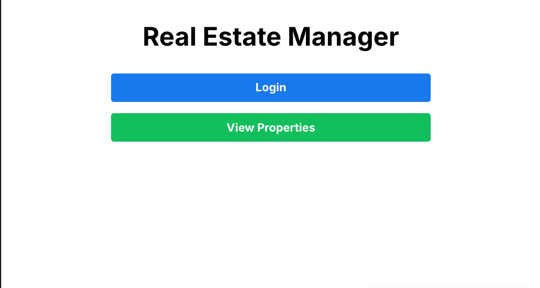
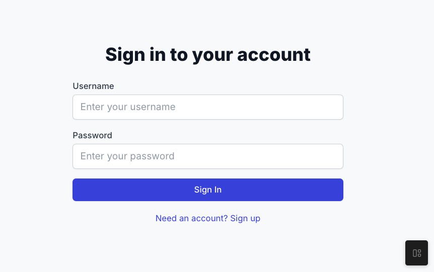
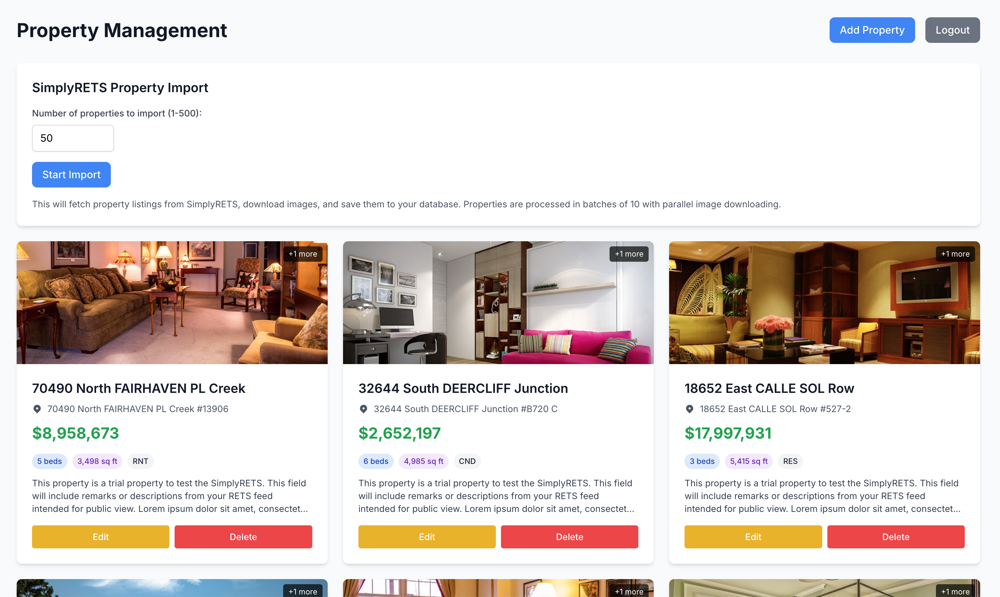
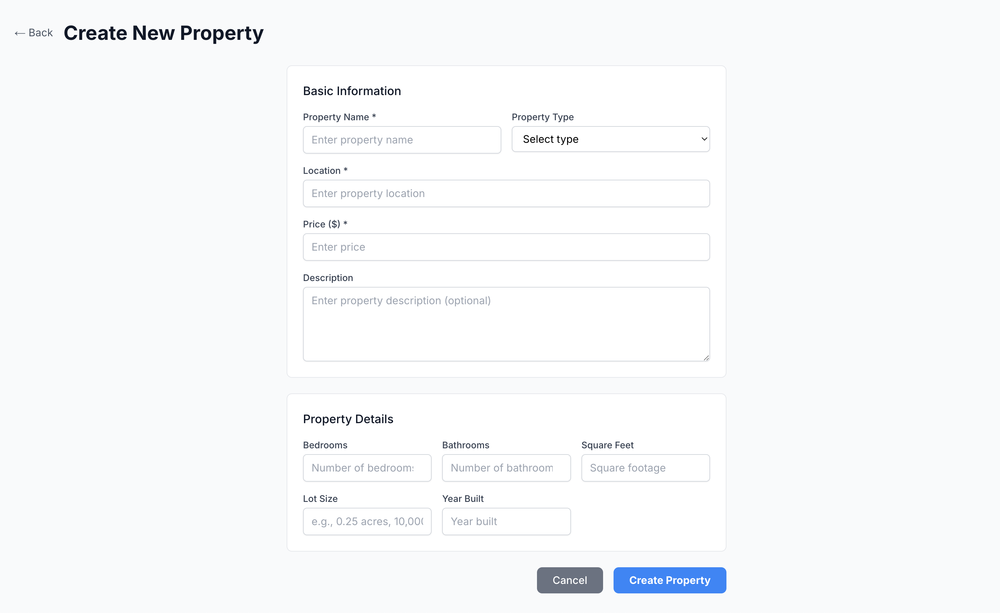
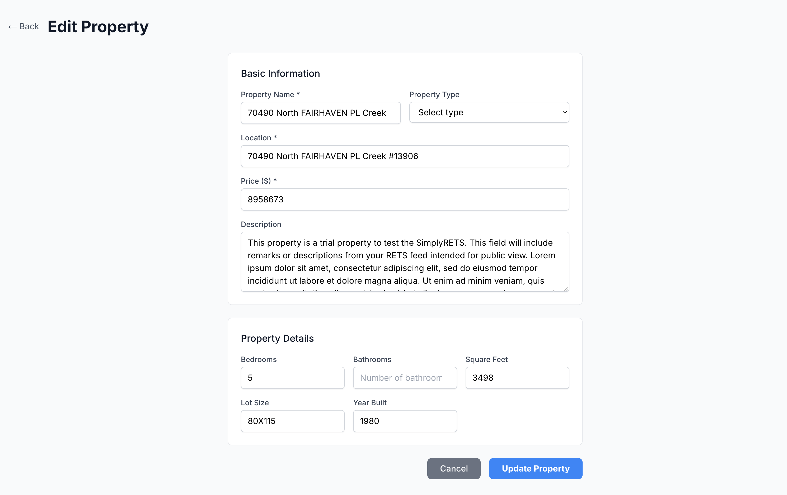
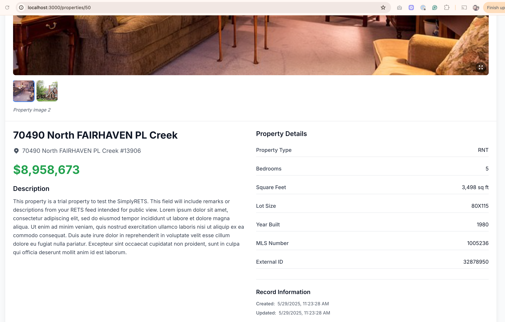
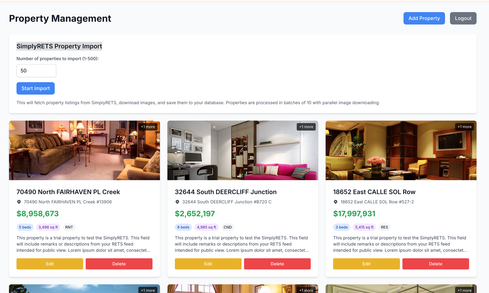

# Real Estate Manager

This project is a full-stack application for managing real estate properties. It consists of a GoLang backend API with JWT authentication and a Next.js frontend for user interaction.

## Table of Contents

- [Interview Goals](#interview-goals)
- [Use Case Motivation](#use-case-motivation)
- [Features](#features)
- [Project Structure](#project-structure)
- [Getting Started](#getting-started)
  - [Option 1: Docker Development Environment (Recommended)](#option-1-docker-development-environment-recommended)
  - [Option 2: Docker Production Environment](#option-2-docker-production-environment)
  - [Option 3: Local Development Setup](#option-3-local-development-setup)
- [Testing](#testing)
- [API Endpoints](#api-endpoints)
- [Environment Variables](#environment-variables)
- [Database Schema](#database-schema)
- [Application Screenshots](#application-screenshots)
- [Usage](#usage)
- [Technologies Used](#technologies-used)
- [Troubleshooting](#troubleshooting)
- [Development Tools & Configuration](#development-tools--configuration)
- [Contributing](#contributing)
- [License](#license)

## Interview Goals

This project demonstrates the following technical requirements:

- ✅ **Backend application written in Go**
  - [JWT authentication](backend/internal/services/auth.go) - Secure user authentication with JSON Web Tokens
  - [Restricted and public APIs](backend/cmd/server/main.go) - Protected routes using middleware
  - [Usage of Go Channels and Routines](backend/internal/services/simplyrets.go) - Concurrent property processing from SimplyRETS API using goroutines and channels for job management

- ✅ **Frontend application written in TypeScript with Next.js**
  - [Next.js 14 with App Router](frontend/src/app/) - Modern React framework with TypeScript
  - [TypeScript types and interfaces](frontend/src/types/) - Type-safe development

- ✅ **Several REST endpoints on the backend invoked from frontend**
  - [API endpoints](backend/internal/handlers/) - Authentication, property management, and SimplyRETS integration
  - [Frontend API client](frontend/src/lib/api.ts) - Type-safe API calls from React components

- ✅ **Integration with database**
  - [MySQL database](backend/pkg/database/) - Full database integration with migrations
  - [Repository pattern](backend/internal/repository/) - Clean data access layer
  - [Database migrations](backend/migrations/) - Schema versioning and management

- ✅ **Developed using Visual Studio Code with GitHub Copilot**
  - [Comprehensive test suite](backend/internal/services/simplyrets_test.go) - Table-driven tests created with AI assistance
  - [Clean architecture](backend/internal/) - Well-structured Go application following best practices

- ✅ **Able to run locally and with Docker Compose in a single command**
  - [Docker Compose setup](docker-compose.yml) - Complete development environment
  - [Production deployment](docker-compose.prod.yml) - Production-ready configuration
  - Single command setup: `docker-compose up --build`

## Use Case Motivation

I chose to develop a real estate application based on my previous experience at **LionDesk/Lone Wolf**, where I had the opportunity to work with real estate technology platforms. This experience provided me with valuable insights into the real estate industry's technical requirements and business processes.

Working at LionDesk/Lone Wolf helped me grow my technical skills and gave me a solid understanding of:
- **Property management systems** and their data structures
- **Real estate APIs** and third-party integrations (like SimplyRETS)
- **User authentication** and role-based access in real estate platforms
- **Database design** for property listings and customer management
- **Modern web technologies** used in real estate software

This background allows me to demonstrate all the topics required in Tucows' Technical Challenge while building something meaningful and practical. The real estate domain provides a perfect context to showcase:
- Complex data relationships (properties, users, photos)
- API integrations with external services
- Concurrent processing for data imports
- User authentication and authorization
- Modern full-stack development practices

By leveraging my domain knowledge from LionDesk/Lone Wolf, I can focus on demonstrating strong technical implementation rather than learning a new business domain, resulting in a more polished and realistic application.

## Features

- **Authentication**: JWT-based user registration and login
- **Property Management**: Full CRUD operations for real estate properties
- **Database**: MySQL with proper migrations and indexing
- **Testing**: Comprehensive test suite with gomock and sqlmock
- **Docker**: Development and production Docker environments
- **Hot Reloading**: Air-powered hot reloading for Go backend development
- **Modern Frontend**: Next.js 14 with TypeScript and Tailwind CSS

## Project Structure

```
real-estate-manager
├── backend
│   ├── cmd
│   │   └── server
│   │       └── main.go          # Entry point of the Go application
│   ├── internal
│   │   ├── handlers
│   │   │   ├── auth.go          # Authentication handlers
│   │   │   └── properties.go     # Property-related handlers
│   │   ├── middleware
│   │   │   └── auth.go          # JWT authentication middleware
│   │   ├── mocks                # Generated gomock files
│   │   │   ├── mock_user_repository.go
│   │   │   └── mock_property_repository.go
│   │   ├── models
│   │   │   ├── property.go       # Property model definition
│   │   │   └── user.go           # User model definition
│   │   ├── repository
│   │   │   ├── property.go       # Database interaction for properties
│   │   │   ├── property_test.go  # Repository tests with sqlmock
│   │   │   ├── user.go           # Database interaction for users
│   │   │   └── user_test.go      # Repository tests with sqlmock
│   │   └── services
│   │       ├── auth.go          # Business logic for authentication
│   │       ├── auth_test.go     # Service tests with gomock
│   │       ├── property.go       # Business logic for property management
│   │       └── property_test.go  # Service tests with gomock
│   ├── pkg
│   │   ├── database
│   │   │   ├── mysql.go         # Database connection
│   │   │   ├── migrate.go       # Migration handling
│   │   │   ├── setup.go         # Database setup utilities
│   │   │   └── config.go        # Database configuration
│   │   └── utils
│   │       └── jwt.go           # JWT token utilities
│   ├── migrations
│   │   ├── 000001_create_users_table.up.sql
│   │   ├── 000001_create_users_table.down.sql
│   │   ├── 000002_create_properties_table.up.sql
│   │   └── 000002_create_properties_table.down.sql
│   ├── .air.toml                # Air configuration for hot reloading
│   ├── Dockerfile               # Production Docker configuration
│   ├── Dockerfile.dev           # Development Docker configuration
│   ├── go.mod                   # Go module definition
│   └── go.sum                   # Dependency checksums
├── frontend
│   ├── src
│   │   ├── app
│   │   │   ├── login
│   │   │   │   └── page.tsx      # Login page component
│   │   │   ├── properties
│   │   │   │   ├── page.tsx      # Properties list page
│   │   │   │   ├── create
│   │   │   │   │   └── page.tsx  # Create property page
│   │   │   │   └── [id]
│   │   │   │       └── edit
│   │   │   │           └── page.tsx # Edit property page
│   │   │   ├── layout.tsx        # Application layout
│   │   │   └── page.tsx          # Main landing page
│   │   ├── components
│   │   │   ├── PropertyForm.tsx   # Property form component
│   │   │   ├── PropertyList.tsx    # Property list component
│   │   │   └── LoginForm.tsx       # Login form component
│   │   ├── lib
│   │   │   ├── api.ts             # API calls to the backend
│   │   │   └── auth.ts            # Authentication handling
│   │   └── types
│   │       └── property.ts        # TypeScript types for properties
│   ├── Dockerfile               # Production Docker configuration
│   ├── Dockerfile.dev           # Development Docker configuration
│   ├── package.json             # npm configuration
│   ├── next.config.js           # Next.js configuration (enhanced for Docker)
│   └── tsconfig.json            # TypeScript configuration
├── docker-compose.yml           # Docker Compose configuration for development
├── docker-compose.prod.yml      # Docker Compose configuration for production
├── init.sql                     # Database initialization
└── README.md                    # Project documentation
```

## Getting Started

### Option 1: Docker Development Environment (Recommended)

This is the easiest way to run the entire application with hot reloading for development.

1. **Prerequisites:**
   - Docker and Docker Compose installed
   - No need for Go, Node.js, or MySQL to be installed locally

2. **Run the development environment:**
   ```bash
   # Clone and navigate to the project root
   cd tucows-interview
   
   # Build and start all services with hot reloading
   docker-compose up --build
   
   # Or run in background
   docker-compose up -d --build
   ```

3. **Development features:**
   - **Backend**: Go with Air hot reloading - changes automatically rebuild and restart
   - **Frontend**: Next.js with file watching - changes automatically refresh
   - **Database**: MySQL with persistent data storage
   - **Logs**: Real-time logs from all services

4. **Access the application:**
   - Frontend: http://localhost:3000
   - Backend API: http://localhost:8080
   - Database: localhost:3306 (username: `root`, password: `password`)

5. **Stop the application:**
   ```bash
   docker-compose down
   
   # To also remove volumes (database data)
   docker-compose down -v
   ```

### Option 2: Docker Production Environment

For production-like testing:

```bash
# Use production docker-compose file
docker-compose -f docker-compose.prod.yml up --build

# Or run in background
docker-compose -f docker-compose.prod.yml up -d --build
```

### Option 3: Local Development Setup

#### Prerequisites
- Go 1.24 or later
- Node.js 18.x (LTS) - **Important: Use Node.js 18, not 24**
- MySQL 8.0

#### Backend Setup

1. **Navigate to the backend directory:**
   ```bash
   cd real-estate-manager/backend
   ```

2. **Install Go dependencies:**
   ```bash
   go mod tidy
   ```

3. **Set up environment variables:**
   ```bash
   export DB_HOST=localhost
   export DB_PORT=3306
   export DB_USER=root
   export DB_PASSWORD=your_mysql_password
   export DB_NAME=real_estate_db
   export JWT_SECRET=your_secret_key
   ```

4. **Run database migrations:**
   ```bash
   # Ensure your MySQL database is running and accessible
   go run cmd/server/main.go
   ```

5. **Start the server:**
   ```bash
   go run cmd/server/main.go
   ```

6. **Alternative: Use Air for hot reloading:**
   ```bash
   # Install Air for hot reloading
   go install github.com/cosmtrek/air@latest
   
   # Start with hot reloading
   air
   ```

#### Frontend Setup

1. **Fix Node.js version if needed:**
   ```bash
   # If using nvm
   nvm install 18.18.0
   nvm use 18.18.0
   
   # Clear npm cache
   npm cache clean --force
   ```

2. **Navigate to the frontend directory:**
   ```bash
   cd real-estate-manager/frontend
   ```

3. **Set up environment variables:**
   ```bash
   # Copy the example environment file
   cp .env.example .env.local
   
   # Edit .env.local with your configuration
   # NEXT_PUBLIC_API_URL=http://localhost:8080/api
   ```

4. **Install dependencies:**
   ```bash
   npm install
   
   # If you get dependency conflicts, try:
   npm install --legacy-peer-deps
   ```

5. **Start the development server:**
   ```bash
   npm run dev
   ```

## Testing

The project includes comprehensive test coverage for both backend services and repositories.

### Running Backend Tests

```bash
cd real-estate-manager/backend

# Run all tests
go test ./...

# Run tests with coverage
go test -cover ./...

# Run tests with detailed coverage report
go test -coverprofile=coverage.out ./...
go tool cover -html=coverage.out

# Run specific test packages
go test ./internal/services/...
go test ./internal/repository/...
```

### Test Coverage

- **Repository Layer**: 100% coverage with sqlmock for database testing
- **Service Layer**: 72.2% coverage with gomock for dependency mocking
- **Total Test Cases**: 70+ comprehensive test cases including edge cases and error scenarios

### Test Technologies

- **gomock**: Type-safe mock generation for interfaces
- **sqlmock**: SQL database mocking for repository testing
- **Table-driven tests**: Comprehensive test scenarios for all methods

### Generating New Mocks

If you modify interfaces, regenerate mocks:

```bash
cd real-estate-manager/backend

# Generate mocks for repository interfaces
go generate ./internal/repository/...

# Or manually generate specific mocks
mockgen -source=internal/repository/user.go -destination=internal/mocks/mock_user_repository.go
mockgen -source=internal/repository/property.go -destination=internal/mocks/mock_property_repository.go
```

## API Endpoints

### Authentication
- `POST /api/register` - Register a new user
- `POST /api/login` - Login and get JWT token

### Properties (Protected - requires JWT token)
- `GET /api/properties` - Get all properties
- `GET /api/properties/:id` - Get property by ID
- `POST /api/properties` - Create new property
- `PUT /api/properties/:id` - Update property
- `DELETE /api/properties/:id` - Delete property

### SimplyRETS Integration (Protected - requires JWT token)
- `POST /api/simplyrets/process` - Start property import from SimplyRETS API
  - Body: `{"limit": 50}` (optional, default: 50, max: 500)
  - Returns: Job ID and processing status
- `GET /api/simplyrets/jobs/:jobId/status` - Get status of a processing job
  - Returns: Job progress, processed count, errors, and completion status
- `DELETE /api/simplyrets/jobs/:jobId` - Cancel a running processing job
  - Returns: Cancellation confirmation
- `GET /api/simplyrets/health` - Health check for SimplyRETS service
  - Returns: Service status and timestamp

### Static Assets
- `GET /images/:filename` - Serve uploaded property images

## Environment Variables

### Backend
- `DB_HOST` - Database host (default: localhost)
- `DB_PORT` - Database port (default: 3306)
- `DB_USER` - Database user (default: root)
- `DB_PASSWORD` - Database password
- `DB_NAME` - Database name (default: real_estate_db)
- `JWT_SECRET` - Secret key for JWT tokens

### Frontend
- `NEXT_PUBLIC_API_URL` - Backend API URL (default: http://localhost:8080/api)

## Database Schema

### Users Table
- `id` - Auto-incrementing primary key
- `username` - Unique username
- `password` - Hashed password
- `email` - User email
- `created_at` - Timestamp
- `updated_at` - Timestamp

### Properties Table
- `id` - Auto-incrementing primary key
- `name` - Property name
- `location` - Property location
- `price` - Property price (decimal)
- `description` - Property description
- `created_at` - Timestamp
- `updated_at` - Timestamp

## Application Screenshots

The following screenshots demonstrate the complete functionality of the Real Estate Manager application:

### 1. Homepage


The main landing page of the application, providing navigation to different sections and user authentication options.

### 2. Login & Registration


User authentication interface allowing users to log in with existing credentials or register a new account. 

### 3. Properties Dashboard


The main property management dashboard showing all available properties. This authenticated view includes options to create, edit, and delete properties, as well as the SimplyRETS integration for importing external property data.

### 4. Create New Property


Form interface for adding new properties to the system. Users can input property details including name, location, price, description, and upload photos.

### 5. Edit Property


Property editing interface allowing users to modify existing property information and update property photos.

### 6. Property Details


Detailed view of individual properties showing all property information, photo gallery, and management options.

### 7. Property Listing


Comprehensive property listing interface displaying all available properties in a clean, organized grid layout. This page serves as the main hub for property management and includes advanced functionality for importing external property data.

**SimplyRETS Property Import Capabilities:**
- **Bulk Import**: Import up to 500 properties from the SimplyRETS API in a single operation
- **Real-time Processing**: Monitor import progress with live status updates and job tracking
- **Concurrent Processing**: Utilizes Go channels and goroutines for efficient data processing
- **Error Handling**: Comprehensive error reporting and recovery for failed imports
- **Job Management**: Start, monitor, and cancel import jobs as needed
- **Data Mapping**: Automatically maps SimplyRETS property data to the internal database schema
- **Status Tracking**: View detailed progress including processed count, errors, and completion status

The SimplyRETS integration demonstrates advanced Go concurrency patterns and provides a seamless way to populate the property database with real estate data from external sources.

### Key Features Demonstrated:
- **JWT Authentication**: Secure login/logout functionality
- **Property CRUD Operations**: Create, read, update, and delete properties
- **Photo Management**: Upload and display property images
- **SimplyRETS Integration**: Import properties from external real estate API
- **Responsive Design**: Modern, clean interface that works across devices
- **Real-time Updates**: Dynamic content updates without page refreshes

## Usage

### Quick Start with Docker

1. **Start the application:**
   ```bash
   cd tucows-interview
   docker-compose up --build
   ```

2. **Register/Login:**
   - Access the frontend at http://localhost:3000
   - Register a new account or login with existing credentials

3. **Test API endpoints:**
   ```bash
   # Register a new user
   curl -X POST http://localhost:8080/api/register \
     -H "Content-Type: application/json" \
     -d '{"username":"testuser","password":"password","email":"test@example.com"}'

   # Login and get JWT token
   curl -X POST http://localhost:8080/api/login \
     -H "Content-Type: application/json" \
     -d '{"username":"testuser","password":"password"}'

   # Use the token to access protected endpoints
   curl -H "Authorization: Bearer YOUR_JWT_TOKEN" \
     http://localhost:8080/api/properties
   ```

4. **Manage Properties:**
   - View all properties on the properties page
   - Create new properties using the create form
   - Edit existing properties by clicking on them
   - Delete properties using the delete button

### Development Workflow

1. **Make changes to backend code** - Air will automatically rebuild and restart
2. **Make changes to frontend code** - Next.js will automatically refresh the browser
3. **Database changes** - Use migrations or modify `init.sql` for development

## Technologies Used

### Backend
- **Language:** Go 1.24
- **Framework:** Gin HTTP framework
- **Authentication:** JWT tokens
- **Database:** MySQL 8.0 with golang-migrate
- **Testing:** gomock, sqlmock, table-driven tests
- **Development:** Air hot reloading

### Frontend
- **Framework:** Next.js 14 with App Router
- **Language:** TypeScript
- **Styling:** Tailwind CSS
- **Authentication:** JWT with client-side auth guards

### Infrastructure
- **Containerization:** Docker with multi-stage builds
- **Orchestration:** Docker Compose
- **Development:** Hot reloading for both frontend and backend
- **Database:** MySQL with persistent volumes

### Dependencies
- **Backend:** 
  - `github.com/gin-gonic/gin` - HTTP framework
  - `github.com/golang-jwt/jwt/v5` - JWT implementation
  - `github.com/go-sql-driver/mysql` - MySQL driver
  - `go.uber.org/mock` - Mock generation
  - `github.com/DATA-DOG/go-sqlmock` - SQL mocking
- **Frontend:**
  - `next@14.0.4` - React framework
  - `typescript@^5.3.0` - Type safety
  - `tailwindcss@^3.3.6` - Utility-first CSS

## Troubleshooting

### Docker Issues

**Container won't start:**
```bash
# Clean up Docker resources
docker-compose down -v
docker system prune -a

# Rebuild from scratch
docker-compose up --build --force-recreate
```

**Port conflicts:**
```bash
# Check what's using the ports
lsof -i :3000  # Frontend
lsof -i :8080  # Backend
lsof -i :3306  # Database

# Kill processes if needed
sudo kill -9 <PID>
```

**Database connection issues:**
```bash
# Check database logs
docker-compose logs db

# Reset database
docker-compose down -v
docker-compose up db
```

### Backend Issues

**Go module issues:**
```bash
cd real-estate-manager/backend
go clean -modcache
go mod download
go mod tidy
```

**Air not working:**
```bash
# Install/update Air
go install github.com/cosmtrek/air@latest

# Check Air configuration
cat .air.toml
```

**Test failures:**
```bash
# Clean test cache
go clean -testcache

# Run tests with verbose output
go test -v ./...

# Check specific failing tests
go test -v ./internal/services/auth_test.go
```

### Database Issues

**Connection refused:**
- Ensure MySQL is running
- Check environment variables
- Verify database credentials
- Check firewall settings

**Migration issues:**
```bash
# Check migration status
docker-compose exec backend go run cmd/server/main.go

# Manual migration
mysql -h localhost -u root -p real_estate_db < init.sql
```

## Development Tools & Configuration

### Air Configuration (.air.toml)
Hot reloading for Go backend development:
- Watches for `.go` file changes
- Excludes test files from triggering rebuilds
- Builds to `./tmp/main` for fast execution
- 1-second delay to batch file changes

### Docker Development
- **Backend**: Multi-stage build with Air for hot reloading
- **Frontend**: Node.js with file polling for Docker environments  
- **Database**: MySQL with persistent volumes and health checks
- **Networking**: Internal Docker network with exposed ports

### Testing Strategy
- **Unit Tests**: gomock for service layer dependencies
- **Integration Tests**: sqlmock for repository database interactions
- **Table-Driven Tests**: Comprehensive test scenarios
- **Coverage**: Detailed coverage reports with `go tool cover`

### Project Architecture
```
┌─────────────────┐    ┌─────────────────┐    ┌─────────────────┐
│   Frontend      │    │   Backend       │    │   Database      │
│   (Next.js)     │◄──►│   (Go/Gin)      │◄──►│   (MySQL)       │
│   Port: 3000    │    │   Port: 8080    │    │   Port: 3306    │
└─────────────────┘    └─────────────────┘    └─────────────────┘
```

### Key Files
- `docker-compose.yml`: Development environment with hot reloading
- `docker-compose.prod.yml`: Production environment 
- `.air.toml`: Air configuration for Go hot reloading
- `next.config.js`: Enhanced Next.js config for Docker
- `init.sql`: Database initialization and schema

## Contributing

1. Fork the repository
2. Create a feature branch: `git checkout -b feature-name`
3. Make changes and add tests
4. Ensure all tests pass: `go test ./...`
5. Commit changes: `git commit -am 'Add feature'`
6. Push to branch: `git push origin feature-name`
7. Submit a pull request

## License

This project is licensed under the MIT License.